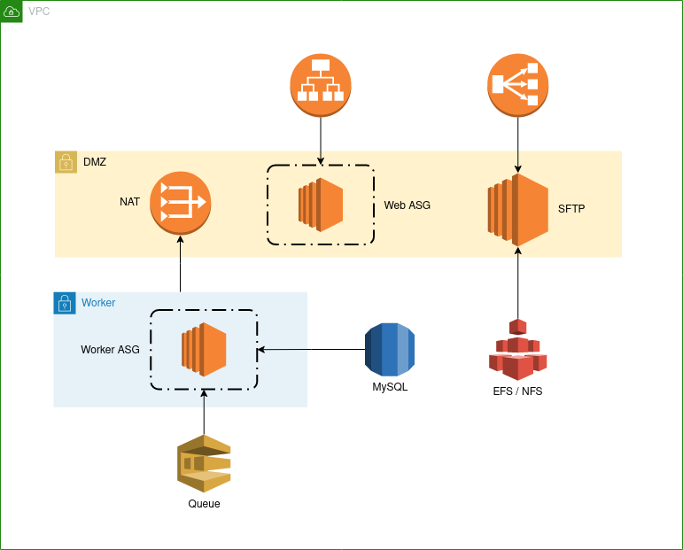

# AWS Playground

This repository contains a simple [AWS][aws] environment built with [Terraform][terraform].

**Prerequsites**

* Terraform => 0.12
* Amazon account

## TL;DR

Environments are separated on VPC level. Variables are stored in var files and default values are supporting local development. This is a PoC so only the *dev* environment has been created so far.

```
export AWS_ACCESS_KEY_ID=<your key id comes here>
export AWS_SECRET_ACCESS_KEY=<your secret comes here>
terraform init
terraform apply -var-file=environments/dev.tfvars
```

## Components



### Web

Web-servers are located at the DMZ network and they automatically scale based on the load of the servers. Service ports are available via an external load-balancer.

### Worker

Worker nodes are located at a private network. They automatically scale based on the load of the servers. Instances can communicate with the outside world via a NAT gateway. (That is located at DMZ network)

### SFTP

SFTP servers are located at the DMZ network. Service ports are available via load-balancers. (Both internally and externally) Files are persisted on an EFS network share.

### Queue

Queueing service is Amazon SQS. Nodes in the worker network can retrieve and delete messages. DMZ nodes can send messages to the queue.

### Database

A MySQL database is hosted in a multi-az RDS instance.

# Security

There is a separated management network where a bastion host (AKA jumpbox) is located at. SSH ports are accassible only from this host.

On your local box you can configure SSH to access internal SSH ports via the bastion host as proxy. Add the following snippet to `~/.ssh/config` file.

```
StrictHostKeyChecking no

Host awsjumpbox
  HostName <bastion host IP comes here>
  User centos
  ForwardAgent yes

Host 10.0*
  User admin
  ProxyCommand ssh awsjumpbox -W %h:%p
```

Bastion host's IP address will be returned by Terraform.

```
terraform output bastion_host
```

TODO: There is only one jumpbox located at only one availability zone. It would be better to set-up a VPN service accross multiple AZs.

## Availability

DMZ and Worker networks are distributed across all the availability zones  in the selected region. Auto-scaling groups will create instances in a distributed fashion.

## Configuration

### Variables

| Name | Type | Default | Description |
|------|------|---------|-------------|
| db_instance_size | string | t2.micro | DB instance class |
| db_password | string | password | The password for the MySQL database |
| db_user | string | user | The user for MySQL database |
| db_storage | number | 10 | The storage allocated to the MySQL database |
| environment | string |  | The name of the enironment |
| ec2_keypair_name | string | processor | The EC2 SSH keypair name |
| region | string | eu-central-1 | The AWS region where the VPC is located at |
| sftp_ami_id | string | ami-032449f6edfd0733f | The AMI ID for SFTP servers |
| sftp_instance_type | string | t2.nano | The instance type for SFTP servers |
| vpc_cidr_block | string | 10.0.0.0/16 | The CIDR block of the VPC |
| web_ami_id | string | ami-098300699405cf362 | The AMI ID for web servers |
| web_instance_type | string | t2.nano | The instance type for web servers |
| web_max_size | number | 3 | The maximum number of instances in web auto-scaling group |
| worker_ami_id | string | ami-01eb7b0c1119f2550 | The AMI ID for worker nodes |
| worker_instance_type | string | t2.nano | The instance type for worker nodes |
| worker_max_size | number | 3 | The maximum number of instances in worker auto-scaling group |


### Outputs

| Name | Description |
|------|-------------|
| bastion_host | The public IP address of the bastion host |
| db_endpoint | The MySQL database endpoint |
| sftp_public_elb_dns_name | The FQDN of the public SFTP elastic load balancer |
| queue_url | The URL of the worker SQS queue |
| web_lb_dns_name | The FQDN of the Load Balancer |

## TODO

* As this is a PoC SSL listener and the corresponding certificate configuration in Web application load-balancer havn't been implemented yet.
* On SFTP nodes the NFS mount command is provided via EC2 instance user-data however the it doesn't seem to be working. It's a provisioning issue.


[aws]:              https://aws.amazon.com/
[terraform]:        https://www.terraform.io